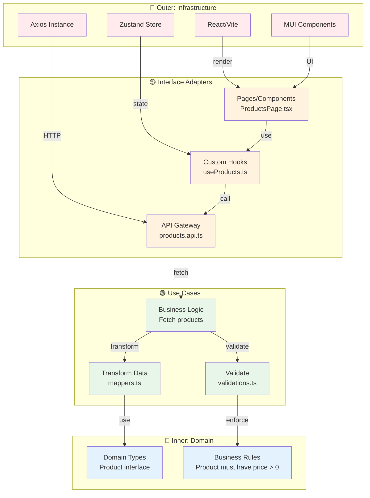

# Architecture Documentation

## Tổng quan

Dự án sử dụng kiến trúc **Feature-Sliced Design** kết hợp với **Clean Architecture**, tập trung vào:

- **Separation of Concerns**: Tách biệt rõ ràng giữa business logic, UI, và infrastructure
- **Module Independence**: Các feature modules độc lập, không phụ thuộc lẫn nhau
- **Scalability**: Dễ dàng thêm feature mới mà không ảnh hưởng code cũ
- **Testability**: Từng layer có thể test riêng biệt
- **Dependency Rule**: Dependencies chỉ đi từ ngoài vào trong (outer → inner layers)

## Clean Architecture Overview

Dự án áp dụng **Clean Architecture** (Uncle Bob) với 4 layers đồng tâm, dependencies chỉ đi từ ngoài vào trong.

**Giải thích diagram**:

1. **LEGEND** (🎨): 4 layers của Clean Architecture với màu sắc nhất quán
2. **PROJECT STRUCTURE** (📁): Mapping folders → layers
3. **DATA FLOW** (🔄): Luồng dữ liệu từ User → Domain
4. **DEPENDENCY RULES** (⚠️): Dependencies chỉ đi từ ngoài vào trong

**Dependency Rule (The Golden Rule)**:

> Source code dependencies **MUST** point **inwards only**.  
> Inner circles know **nothing** about outer circles.

```
🔴 Frameworks ──depends on──> 🟡 Adapters ──depends on──> 🟢 Use Cases ──depends on──> 🔵 Domain
   (Detail)                     (Interface)                  (Logic)                    (Policy)

   ❌ Inner circles CANNOT import outer circles
   ✅ Outer circles CAN import inner circles
```

| Clean Layer                    | Project Folders                                                   | Trách nhiệm                                    | Example                              |
| ------------------------------ | ----------------------------------------------------------------- | ---------------------------------------------- | ------------------------------------ |
| **🔵 Entities (Domain)**       | `modules/*/_domain/`                                             | Business models, business rules, invariants    | `auth.model.ts`, `auth.rules.ts`     |
| **🟢 Use Cases (Application)** | `modules/*/_usecases/`, `modules/*/_api/`, `modules/*/hooks/`    | Validations, mappers, data fetching, logic     | `validations.ts`, `mappers.ts`, `useLoginMutate.ts` |
| **🟡 Interface Adapters**      | `modules/*/_routes/`, `modules/*/pages/`, `modules/*/components/` | Routes, UI presentation, user interaction      | `_routes/index.tsx`, `LoginPage.tsx` |
| **🔴 Frameworks & Drivers**    | `@core/`, `@themes/`, `shared/`, `modules/*/_providers/`         | Infrastructure, frameworks, libraries          | Axios, React, MUI, `AuthProvider.tsx` |

### Dependency Flow (Clean Architecture)



## Module Structure (Clean Architecture)

### Standard Module Structure

Mỗi feature module trong `modules/<feature>/` tuân theo Clean Architecture:

```
modules/<feature>/
├── _domain/            # 🔵 Domain Layer (Innermost)
│   ├── <feature>.model.ts   # Domain models, entities
│   └── <feature>.rules.ts   # Business rules, constants
│
├── _usecases/          # 🟢 Use Cases Layer
│   ├── validations.ts       # Zod schemas (uses domain rules)
│   └── mappers.ts           # Data transformations (DTO ↔ Model)
│
├── _api/               # 🟢 Use Cases Layer (Gateway)
│   ├── <feature>.api.ts     # API calls (uses mappers)
│   └── <feature>.type.ts    # DTOs (Data Transfer Objects)
│
├── _providers/         # 🔴 Infrastructure Layer (optional)
│   └── <Feature>Provider.tsx # Context providers
│
├── _routes/            # 🟡 Adapter Layer
│   ├── index.tsx            # Route config với metadata
│   └── path.ts              # Path constants
│
├── <sub-feature>/      # Sub-feature (optional)
│   ├── _routes/
│   ├── components/          # 🟡 Adapter Layer
│   ├── hooks/               # 🟢 Use Cases Layer
│   └── pages/               # 🟡 Adapter Layer
│
├── components/         # 🟡 Adapter Layer (top-level)
├── hooks/              # 🟢 Use Cases Layer (top-level)
└── pages/              # 🟡 Adapter Layer (top-level)
```

### Real Example: Auth Module

```
modules/auth/
├── _domain/
│   ├── auth.model.ts        # 🔵 User, AuthState interfaces
│   └── auth.rules.ts        # 🔵 MIN_PASSWORD_LENGTH = 8
│
├── _usecases/
│   ├── validations.ts       # 🟢 loginSchema (uses MIN_PASSWORD_LENGTH)
│   └── mappers.ts           # 🟢 mapLoginFormToApi()
│
├── _api/
│   ├── auth.api.ts          # 🟢 login(), logout() API calls
│   └── auth.type.ts         # 🔵 AuthLoginRequest, AuthResponse DTOs
│
├── _providers/
│   └── AuthProvider.tsx     # 🔴 Authentication context provider
│
├── _routes/
│   ├── index.tsx            # 🟡 Auth routes config
│   └── path.ts              # 🟡 /auth, /auth/login paths
│
└── login/                   # Sub-feature
    ├── _routes/
    │   └── index.tsx        # 🟡 Login route
    ├── components/
    │   └── LoginForm.tsx    # 🟡 Form component
    ├── hooks/
    │   └── useLoginMutate.ts # 🟢 Login mutation hook
    └── pages/
        └── LoginPage.tsx    # 🟡 Login page container
```

### Layer Dependencies trong Module

```mermaid
graph TB
    subgraph "Auth Module"
        subgraph D["🔵 Domain (_domain/)"]
            D1[auth.model.ts]
            D2[auth.rules.ts]
        end
        
        subgraph UC["🟢 Use Cases"]
            UC1[_usecases/<br/>validations.ts]
            UC2[_usecases/<br/>mappers.ts]
            UC3[_api/<br/>auth.api.ts]
            UC4[login/hooks/<br/>useLoginMutate.ts]
        end
        
        subgraph AD["🟡 Adapters"]
            AD1[_routes/<br/>index.tsx]
            AD2[login/pages/<br/>LoginPage.tsx]
            AD3[login/components/<br/>LoginForm.tsx]
        end
        
        subgraph FR["🔴 Infrastructure"]
            FR1[_providers/<br/>AuthProvider.tsx]
            FR2[@core/axios]
        end
    end
    
    AD2 -->|uses| UC4
    AD3 -->|uses| UC4
    
    UC4 -->|calls| UC3
    UC3 -->|HTTP| FR2
    UC3 -->|transforms| UC2
    
    UC1 -->|enforces| D2
    UC2 -->|validates| D1
    
    FR1 -->|provides| AD2
    
    style D1 fill:#e3f2fd
    style D2 fill:#e3f2fd
    style UC1 fill:#e8f5e9
    style UC2 fill:#e8f5e9
    style UC3 fill:#e8f5e9
    style UC4 fill:#e8f5e9
    style AD1 fill:#fff3e0
    style AD2 fill:#fff3e0
    style AD3 fill:#fff3e0
    style FR1 fill:#ffebee
    style FR2 fill:#ffebee
```

### Code Examples

**1. Domain Layer** - Business Rules

```typescript
// modules/auth/_domain/auth.rules.ts
export const MIN_PASSWORD_LENGTH = 8;
export const MAX_PASSWORD_LENGTH = 128;
```

**2. Domain Layer** - Models

```typescript
// modules/auth/_domain/auth.model.ts
export interface User {
  id: string;
  email: string;
  name: string;
  roles: string[];
}

export interface AuthState {
  user: User | null;
  accessToken: string | null;
  isAuthenticated: boolean;
}
```

**3. Use Cases** - Validation (uses Domain Rules)

```typescript
// modules/auth/_usecases/validations.ts
import { z } from "zod";
import { MIN_PASSWORD_LENGTH } from "../_domain/auth.rules";

export const loginSchema = z.object({
  email: z.string().email("Email không hợp lệ"),
  password: z
    .string()
    .min(MIN_PASSWORD_LENGTH, `Mật khẩu phải có ít nhất ${MIN_PASSWORD_LENGTH} ký tự`),
});

export type LoginSchema = z.infer<typeof loginSchema>;
```

**4. Use Cases** - Mapper

```typescript
// modules/auth/_usecases/mappers.ts
import type { AuthLoginRequest } from "../_api/auth.type";
import type { LoginSchema } from "./validations";

export function mapLoginFormToApi(data: LoginSchema): AuthLoginRequest {
  return {
    usernameOrEmail: data.email.trim(),
    password: data.password,
  };
}
```

**5. Use Cases** - API Gateway (uses Mapper)

```typescript
// modules/auth/_api/auth.api.ts
import axiosInstance from "@core/axios";
import type { AuthLoginRequest, AuthResponse } from "./auth.type";

const authApi = {
  login: async (data: AuthLoginRequest): Promise<AuthResponse> => {
    const response = await axiosInstance.post("/auth/login", data);
    return response.data;
  },
};

export default authApi;
```

**6. Use Cases** - Hook (uses API)

```typescript
// modules/auth/login/hooks/useLoginMutate.ts
import { useMutation } from "@tanstack/react-query";
import authApi from "@modules/auth/_api/auth.api";

export const useLoginMutate = () => {
  return useMutation({
    mutationFn: authApi.login,
  });
};
```

**7. Adapter** - Component (uses Hook & Validation)

```typescript
// modules/auth/login/components/LoginForm.tsx
import { FormProvider, useForm } from "react-hook-form";
import { loginSchema, type LoginSchema } from "../../_usecases/validations";
import { mapLoginFormToApi } from "../../_usecases/mappers";
import { useLoginMutate } from "../hooks/useLoginMutate";

export default function LoginForm() {
  const form = useForm<LoginSchema>({
    resolver: zodResolver(loginSchema),
  });
  
  const { mutate, isPending } = useLoginMutate();
  
  const onSubmit = (data: LoginSchema) => {
    mutate(mapLoginFormToApi(data));
  };
  
  return (
    <FormProvider {...form}>
      <form onSubmit={form.handleSubmit(onSubmit)}>
        {/* Form fields */}
      </form>
    </FormProvider>
  );
}
```

### Benefits của Structure này

| Benefit | Mô tả |
|---------|-------|
| ✅ **Clear Separation** | Mỗi layer có folder riêng (`_domain/`, `_usecases/`, `_api/`) |
| ✅ **Testable** | Test domain rules, validations, mappers độc lập |
| ✅ **Maintainable** | Thay đổi validation không ảnh hưởng API |
| ✅ **Scalable** | Thêm rules mới trong `_domain/`, validations sẽ tự update |
| ✅ **Type-safe** | DTOs, Models, Schemas tách rõ ràng |

## Tài liệu tham khảo

### Clean Architecture
- [Clean Architecture (Uncle Bob)](https://blog.cleancoder.com/uncle-bob/2012/08/13/the-clean-architecture.html)
- [The Clean Code Blog](https://blog.cleancoder.com/)

### Internal Docs
- [DEPENDENCY_RULES.md](./DEPENDENCY_RULES.md) - Chi tiết quy tắc import
- [MODULE_TEMPLATE.md](./MODULE_TEMPLATE.md) - Template tạo module mới
- [CLEAN_ARCHITECTURE_SUMMARY.md](./CLEAN_ARCHITECTURE_SUMMARY.md) - Tóm tắt Clean Architecture
