# Architecture Documentation

## Tổng quan

Dự án sử dụng kiến trúc **Feature-Sliced Design** kết hợp với **Clean Architecture**, tập trung vào:

- **Separation of Concerns**: Tách biệt rõ ràng giữa business logic, UI, và infrastructure
- **Module Independence**: Các feature modules độc lập, không phụ thuộc lẫn nhau
- **Scalability**: Dễ dàng thêm feature mới mà không ảnh hưởng code cũ
- **Testability**: Từng layer có thể test riêng biệt
- **Dependency Rule**: Dependencies chỉ đi từ ngoài vào trong (outer → inner layers)

## Clean Architecture Overview

Dự án áp dụng **Clean Architecture** (Uncle Bob) với 4 layers đồng tâm, dependencies chỉ đi từ ngoài vào trong:

### The Clean Architecture Circles

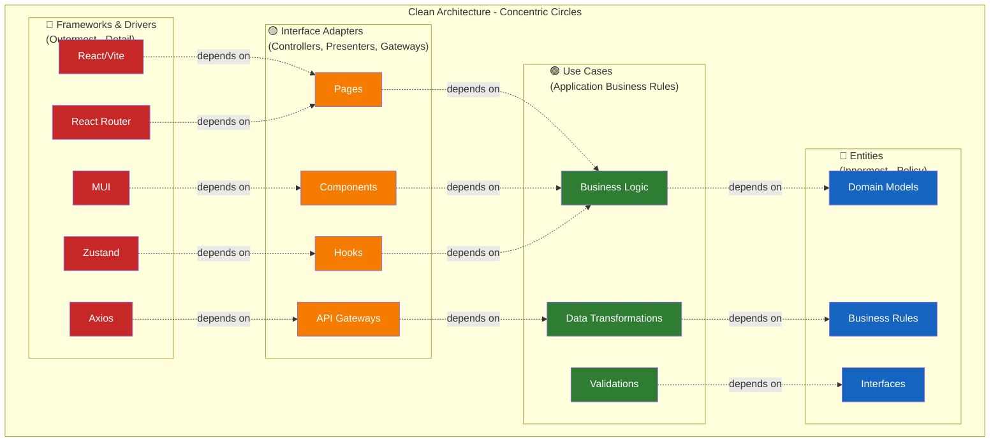

**Dependency Rule (The Golden Rule)**:

> Source code dependencies **MUST** point **inwards only**.  
> Inner circles know **nothing** about outer circles.

```
🔴 Frameworks ──depends on──> 🟡 Adapters ──depends on──> 🟢 Use Cases ──depends on──> 🔵 Entities
   (Detail)                     (Interface)                  (Logic)                    (Policy)

   ❌ Inner circles CANNOT import outer circles
   ✅ Outer circles CAN import inner circles
```

Dự án áp dụng Clean Architecture với 4 layers chính:

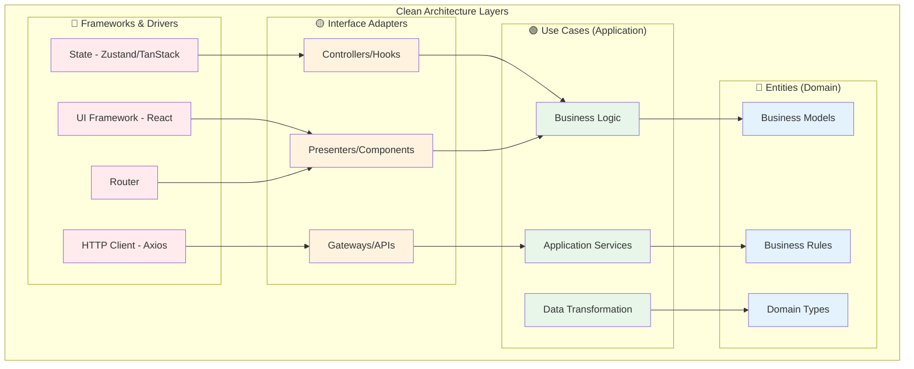

### Mapping Clean Architecture → Project Structure

```mermaid
graph LR
    subgraph "Clean Architecture"
        CA1[🔵 Domain/Entities]
        CA2[🟢 Use Cases]
        CA3[🟡 Interface Adapters]
        CA4[🔴 Frameworks]
    end
    
    subgraph "Project Structure"
        PS1[types/, models/]
        PS2[hooks/, utils/, _api/]
        PS3[pages/, components/]
        PS4[@core/, @themes/, shared/]
    end
    
    CA1 -.->|Map to| PS1
    CA2 -.->|Map to| PS2
    CA3 -.->|Map to| PS3
    CA4 -.->|Map to| PS4
    
    style CA1 fill:#e3f2fd
    style CA2 fill:#e8f5e9
    style CA3 fill:#fff3e0
    style CA4 fill:#ffebee
```

| Clean Layer | Project Folders | Trách nhiệm | Example |
|-------------|----------------|-------------|---------|
| **🔵 Entities (Domain)** | `modules/*/types/`, `modules/*/_api/*.type.ts` | Business models, domain rules, interfaces | `Product`, `User`, `Order` types |
| **🟢 Use Cases (Application)** | `modules/*/hooks/`, `modules/*/utils/`, `modules/*/_api/*.api.ts` | Business logic, data fetching, transformations | `useProducts`, `mapProductFormToApi` |
| **🟡 Interface Adapters** | `modules/*/pages/`, `modules/*/components/` | UI presentation, user interaction | `ProductsPage`, `ProductForm` |
| **🔴 Frameworks & Drivers** | `@core/`, `@themes/`, `shared/` | Infrastructure, frameworks, libraries | Axios, React, MUI, Zustand |

### Dependency Flow (Clean Architecture)

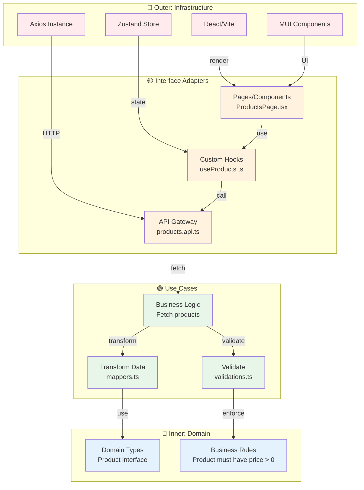

**Quy tắc**: Dependencies chỉ đi từ **ngoài vào trong** (outer → inner):
- ✅ Pages (Adapter) → Hooks (Use Case) → Types (Domain)
- ❌ Domain → Use Cases (KHÔNG được)
- ❌ Use Cases → Pages (KHÔNG được)

### Use Case Flow Example: Fetch Products

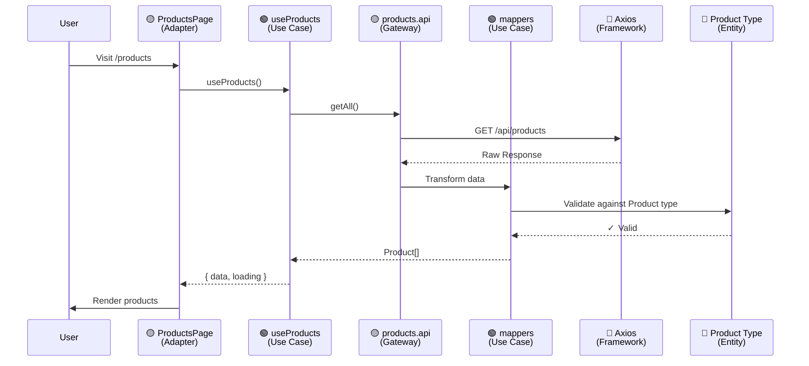

### Business Logic Flow: Create Product

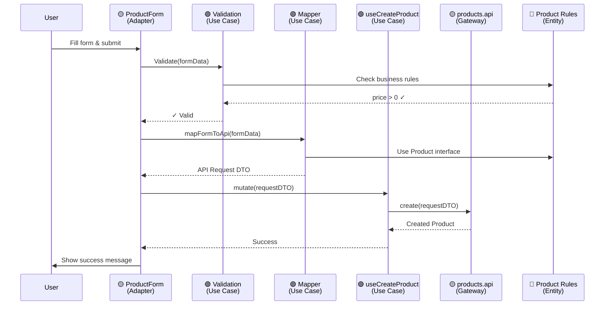

## Folder Structure

```
src/
├── @core/              # Core infrastructure layer
├── @themes/            # Design system & theming
├── modules/            # Feature modules (business domains)
├── routes/             # Top-level routing config
├── shared/             # Shared primitives & utilities
├── App.tsx
├── AppRouter.tsx
└── main.tsx
```

## Layer Architecture

```mermaid
graph TB
    subgraph "Application Layers"
        A[App Entry<br/>main.tsx, App.tsx]
        B[@core<br/>Infrastructure]
        C[@themes<br/>Design System]
        D[modules<br/>Features]
        E[routes<br/>Routing]
        F[shared<br/>Primitives]
    end
    
    A --> B
    A --> C
    A --> E
    E --> D
    D --> F
    D --> B
    D --> C
    B --> F
    C --> F
    
    style A fill:#e1f5ff
    style B fill:#fff3e0
    style C fill:#f3e5f5
    style D fill:#e8f5e9
    style E fill:#fce4ec
    style F fill:#f5f5f5
```

## Dependency Rules

**Quy tắc vàng**: Layer thấp **KHÔNG ĐƯỢC** phụ thuộc vào layer cao.

```mermaid
graph LR
    A[modules] -->|✅ CAN import| B[shared]
    A -->|✅ CAN import| C[@core]
    A -->|✅ CAN import| D[@themes]
    A -.->|❌ CANNOT| E[other modules]
    
    C -.->|❌ CANNOT| A
    B -.->|❌ CANNOT| A
    B -.->|❌ CANNOT| C
    
    F[routes] -->|✅ CAN import| A
    F -->|✅ CAN import| C
    
    style A fill:#e8f5e9
    style C fill:#fff3e0
    style B fill:#f5f5f5
```

### Chi tiết dependency rules:

| From | To | Allowed? | Lý do |
|------|----|----|-------|
| `modules/` | `@core/` | ✅ YES | Feature dùng infrastructure |
| `modules/` | `@themes/` | ✅ YES | Feature dùng design tokens |
| `modules/` | `shared/` | ✅ YES | Feature dùng primitives |
| `modules/feature-a` | `modules/feature-b` | ❌ NO | Features phải độc lập |
| `@core/` | `modules/` | ❌ NO | Infra không biết features |
| `@core/` | `@themes/` | ✅ YES | Infra có thể dùng theme |
| `@core/` | `shared/` | ✅ YES | Infra dùng utilities |
| `shared/` | `@core/` | ⚠️ AVOID | Chỉ import types nếu cần |
| `shared/` | `modules/` | ❌ NO | Shared không biết features |

## Layer Chi Tiết

### 1. @core - Infrastructure Layer

**Mục đích**: Cung cấp hạ tầng chung cho toàn app.

```
@core/
├── __mocks__/          # MSW mock handlers
├── api-contract/       # OpenAPI contracts với BE
├── app-shell/          # Layout system (header, drawer, sidebar)
├── axios/              # HTTP client config
├── constants/          # App-level constants & config
├── errors/             # Error pages (401, 404, 500)
├── middlewares/        # Route middlewares (auth, logging)
├── modal/              # Modal engine & registry
└── providers/          # Root providers (theme, query, auth)
```

**Trách nhiệm**:
- App shell (layout, navigation)
- HTTP client setup
- Authentication middleware
- Modal engine
- Error handling chung
- Mock API handlers

**Không được**:
- Chứa business logic của feature
- Import từ `modules/`
- Biết về dashboard, settings, etc.

### 2. @themes - Design System

**Mục đích**: Tập trung toàn bộ design tokens, component overrides.

```
@themes/
├── _customize/         # Theme customization hooks
├── colors/             # Color palettes (light/dark)
├── overrides/          # MUI component overrides
└── providers/          # Theme provider wrapper
```

**Trách nhiệm**:
- Color schemes
- Typography scale
- Spacing system
- Breakpoints
- Component style overrides
- Theme switching

### 3. modules - Feature Layer

**Mục đích**: Chứa business domains, mỗi module là một feature độc lập.

```
modules/
├── auth/
│   ├── _api/           # Auth API calls
│   ├── _routes/        # Auth routes & path constants
│   └── login/
│       ├── components/ # LoginForm
│       ├── hooks/      # useLoginMutate
│       ├── pages/      # LoginPage
│       └── utils/      # validation, mappers
├── dashboard/
│   ├── _api/
│   ├── _routes/
│   ├── components/     # Charts, Stats
│   ├── hooks/
│   └── pages/
└── settings/
    ├── _routes/
    ├── account/        # Sub-feature
    └── color/          # Sub-feature
```

**Structure template cho mỗi feature**:

```
modules/<feature>/
├── _api/               # API layer (queries, mutations)
│   ├── <feature>.api.ts
│   └── <feature>.type.ts
├── _routes/            # Routing config
│   ├── index.tsx       # Route object với metadata
│   └── path.ts         # Path constants
├── components/         # Internal components
├── hooks/              # Custom hooks (useXXX)
├── pages/              # Page components
├── types/              # Feature-specific types (optional)
└── utils/              # Helpers, validators, mappers
```

**Quy tắc**:
- Mỗi feature tự túc (self-contained)
- Không import từ feature khác
- API, hooks, utils nằm trong feature
- Route metadata để generate menu tự động

#### Clean Architecture trong Module

Mỗi module áp dụng Clean Architecture với các layer rõ ràng:

```mermaid
graph TB
    subgraph "Module: Products"
        subgraph "🔵 Domain Layer"
            D1[types/<br/>Product.type.ts]
            D2[Business Rules<br/>trong validators]
        end
        
        subgraph "🟢 Use Case Layer"
            U1[_api/<br/>products.api.ts]
            U2[hooks/<br/>useProducts.ts]
            U3[utils/<br/>mappers.ts<br/>validations.ts]
        end
        
        subgraph "🟡 Interface Adapter Layer"
            A1[pages/<br/>ProductsPage.tsx]
            A2[components/<br/>ProductForm.tsx<br/>ProductTable.tsx]
        end
        
        subgraph "🔴 External (Framework)"
            F1[@core/axios]
            F2[React Components]
            F3[TanStack Query]
        end
    end
    
    A1 -->|use| U2
    A2 -->|use| U2
    
    U2 -->|call| U1
    U2 -->|use| F3
    
    U1 -->|HTTP| F1
    U3 -->|validate| D2
    U3 -->|transform| D1
    
    A1 -->|render| F2
    A2 -->|render| F2
    
    style D1 fill:#e3f2fd
    style D2 fill:#e3f2fd
    style U1 fill:#e8f5e9
    style U2 fill:#e8f5e9
    style U3 fill:#e8f5e9
    style A1 fill:#fff3e0
    style A2 fill:#fff3e0
    style F1 fill:#ffebee
    style F2 fill:#ffebee
    style F3 fill:#ffebee
```

**Folder → Clean Layer mapping trong module**:

| Folder trong Module | Clean Layer | Trách nhiệm | Dependencies |
|---------------------|-------------|-------------|--------------|
| `types/` | 🔵 **Domain** | Business models, interfaces | None (innermost) |
| `_api/*.type.ts` | 🔵 **Domain** | API contracts, DTOs | None |
| `_api/*.api.ts` | 🟢 **Use Cases** | API calls, data fetching | `types/`, `@core/axios` |
| `hooks/` | 🟢 **Use Cases** | Business logic, state management | `_api/`, `types/`, TanStack Query |
| `utils/validations.ts` | 🟢 **Use Cases** | Business rules enforcement | `types/`, Zod |
| `utils/mappers.ts` | 🟢 **Use Cases** | Data transformation | `types/` |
| `components/` | 🟡 **Adapters** | Reusable UI components | `hooks/`, MUI |
| `pages/` | 🟡 **Adapters** | Page containers | `hooks/`, `components/` |
| External libs | 🔴 **Frameworks** | React, Axios, MUI, Zustand | - |

**Example: Products Module theo Clean Architecture**

```
modules/products/
├── types/                    # 🔵 Domain Layer
│   ├── Product.type.ts       # Core entity
│   └── index.ts
│
├── _api/                     # 🟢 Use Cases + 🔵 Domain
│   ├── products.type.ts      # DTOs (Domain)
│   └── products.api.ts       # API Gateway (Use Case)
│
├── hooks/                    # 🟢 Use Cases
│   ├── useProducts.ts        # Query logic
│   ├── useCreateProduct.ts   # Mutation logic
│   └── useProductById.ts
│
├── utils/                    # 🟢 Use Cases
│   ├── validations.ts        # Business rules
│   ├── mappers.ts            # Transformations
│   └── helpers.ts
│
├── components/               # 🟡 Interface Adapters
│   ├── ProductCard.tsx
│   ├── ProductForm.tsx
│   └── ProductTable.tsx
│
├── pages/                    # 🟡 Interface Adapters
│   ├── ProductsPage.tsx
│   └── ProductDetailPage.tsx
│
└── _routes/                  # 🟡 Interface Adapters
    ├── index.tsx
    └── path.ts
```

**Data Flow trong Module (Clean Architecture)**:

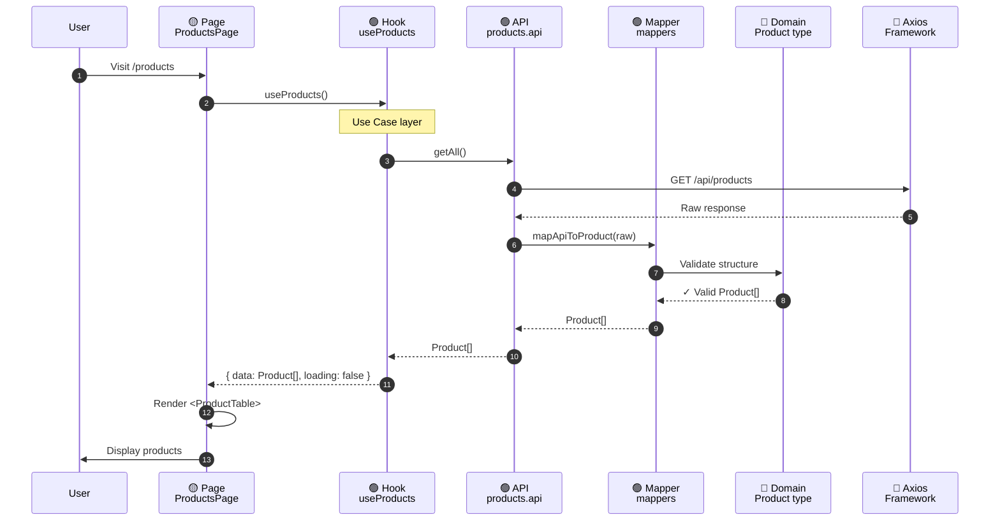

**Ví dụ cụ thể**:

```typescript
// 1️⃣ 🔵 DOMAIN LAYER - types/Product.type.ts
export interface Product {
  id: string;
  name: string;
  price: number;
  stock: number;
  category: string;
  createdAt: Date;
}

// Business rule: Product invariants
export const ProductRules = {
  MIN_PRICE: 0,
  MAX_NAME_LENGTH: 100,
} as const;

// 2️⃣ 🔵 DOMAIN LAYER - _api/products.type.ts (DTOs)
export interface ProductDTO {
  id: string;
  name: string;
  price: number;
  stock: number;
  category: string;
  created_at: string; // API format
}

export interface CreateProductRequest {
  name: string;
  price: number;
  stock: number;
  category: string;
}

// 3️⃣ 🟢 USE CASE LAYER - utils/validations.ts
import { z } from "zod";
import { ProductRules } from "../types/Product.type";

export const productSchema = z.object({
  name: z.string()
    .min(1, "Name required")
    .max(ProductRules.MAX_NAME_LENGTH),
  price: z.number()
    .min(ProductRules.MIN_PRICE, "Price must be >= 0"),
  stock: z.number().int().min(0),
  category: z.string().min(1),
});

// 4️⃣ 🟢 USE CASE LAYER - utils/mappers.ts
import type { Product } from "../types/Product.type";
import type { ProductDTO } from "../_api/products.type";

export function mapDTOToProduct(dto: ProductDTO): Product {
  return {
    id: dto.id,
    name: dto.name,
    price: dto.price,
    stock: dto.stock,
    category: dto.category,
    createdAt: new Date(dto.created_at),
  };
}

// 5️⃣ 🟢 USE CASE LAYER - _api/products.api.ts
import axiosInstance from "@core/axios";
import type { ProductDTO } from "./products.type";
import { mapDTOToProduct } from "../utils/mappers";

export const productsApi = {
  getAll: async () => {
    const res = await axiosInstance.get<ProductDTO[]>("/products");
    // Transform tại đây (Use Case responsibility)
    return res.data.map(mapDTOToProduct);
  },
  
  create: async (data: CreateProductRequest) => {
    const res = await axiosInstance.post<ProductDTO>("/products", data);
    return mapDTOToProduct(res.data);
  },
};

// 6️⃣ 🟢 USE CASE LAYER - hooks/useProducts.ts
import { useQuery } from "@tanstack/react-query";
import { productsApi } from "../_api/products.api";
import type { Product } from "../types/Product.type";

export const useProducts = () => {
  return useQuery<Product[], Error>({
    queryKey: ["products"],
    queryFn: productsApi.getAll,
    staleTime: 5 * 60 * 1000,
  });
};

// 7️⃣ 🟡 INTERFACE ADAPTER - components/ProductCard.tsx
import type { Product } from "../types/Product.type";

interface Props {
  product: Product;
}

export default function ProductCard({ product }: Props) {
  return (
    <div>
      <h3>{product.name}</h3>
      <p>${product.price}</p>
      <p>Stock: {product.stock}</p>
    </div>
  );
}

// 8️⃣ 🟡 INTERFACE ADAPTER - pages/ProductsPage.tsx
import { useProducts } from "../hooks/useProducts";
import ProductCard from "../components/ProductCard";

export default function ProductsPage() {
  const { data: products, isLoading, error } = useProducts();
  
  if (isLoading) return <div>Loading...</div>;
  if (error) return <div>Error: {error.message}</div>;
  
  return (
    <div>
      <h1>Products</h1>
      <div className="grid">
        {products?.map(product => (
          <ProductCard key={product.id} product={product} />
        ))}
      </div>
    </div>
  );
}
```

**Benefits của Clean Architecture trong Module**:

| Benefit | Mô tả |
|---------|-------|
| ✅ **Testability** | Test từng layer độc lập: validate business rules không cần UI |
| ✅ **Maintainability** | Thay đổi UI không ảnh hưởng business logic |
| ✅ **Flexibility** | Swap framework (React → Vue) chỉ sửa Adapter layer |
| ✅ **Reusability** | Use Cases/Domain có thể dùng lại ở mobile app |
| ✅ **Clear Boundaries** | Mỗi layer có trách nhiệm rõ ràng |

### 4. routes - Routing Layer

**Mục đích**: Tập trung top-level route config.

```
routes/
├── privateRoute.tsx    # Protected routes (dashboard, settings)
├── publicRoute.tsx     # Public routes (auth)
└── wildcardRoute.tsx   # 404 fallback
```

**Trách nhiệm**:
- Gộp routes từ modules
- Apply middleware (auth, logging)
- Export route config cho menu

### 5. shared - Shared Layer

**Mục đích**: Primitives & utilities dùng chung, không thuộc feature nào.

```
shared/
├── components/         # Reusable UI primitives
│   ├── charts/         # Chart components
│   ├── forms/          # Form inputs
│   └── modals/         # Base modal
├── hooks/              # Generic hooks (useDebounce, useMedia)
├── types/              # Shared types
└── utils/              # Pure utilities
```

**Quy tắc**:
- Chỉ để thứ **thực sự dùng chung** (≥2 features)
- Không chứa business logic
- Không import từ `@core` (trừ types)
- Không import từ `modules`

## Data Flow

### 1. Feature Data Flow (API → UI)

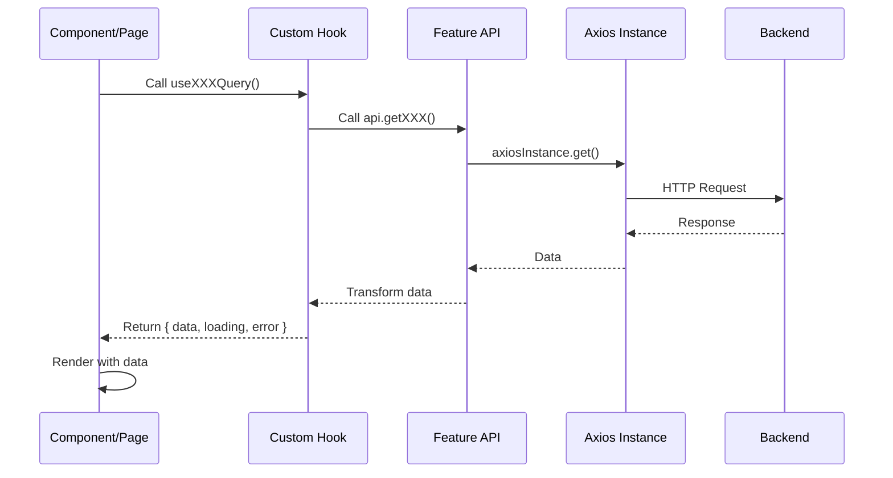

**Example**:

```typescript
// 1. API Layer
// modules/dashboard/_api/dashboard.api.ts
export const dashboardApi = {
  getStats: async () => {
    const res = await axiosInstance.get('/dashboard/stats');
    return res.data;
  }
};

// 2. Hook Layer
// modules/dashboard/hooks/useDashboardStats.ts
export const useDashboardStats = () => {
  return useQuery({
    queryKey: ['dashboard', 'stats'],
    queryFn: dashboardApi.getStats,
  });
};

// 3. UI Layer
// modules/dashboard/pages/DashboardPage.tsx
function DashboardPage() {
  const { data, isLoading } = useDashboardStats();
  if (isLoading) return <Spinner />;
  return <StatsGrid stats={data} />;
}
```

### 2. Menu Generation Flow

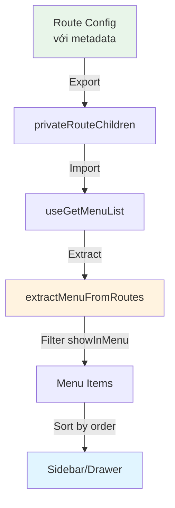

**Cách hoạt động**:

```typescript
// 1. Định nghĩa route với metadata
// modules/dashboard/_routes/index.tsx
const dashboardRoute: RouteWithMeta = {
  path: "/dashboard",
  element: <DashboardPage />,
  meta: {
    label: "Dashboard",
    icon: <Dashboard />,
    showInMenu: true,    // ← Hiển thị trong menu
    order: 1,             // ← Thứ tự sắp xếp
  }
};

// 2. Export route children
// routes/privateRoute.tsx
export const privateRouteChildren = [
  dashboardRoute,
  settingsRoute,
];

// 3. Auto-generate menu
// @core/app-shell/hooks/useGetMenuList.tsx
const useGetMenuList = () => {
  return useMemo(() => 
    extractMenuFromRoutes(privateRouteChildren),
  []);
};

// 4. Sử dụng trong layout
// @core/app-shell/layouts/PrivateLayout.tsx
const menuList = useGetMenuList();
<BaseDrawerDesktop listItems={menuList} />
```

**Lợi ích**:
- ✅ Single source of truth (route config)
- ✅ Không cần hard-code menu
- ✅ Thêm route mới → menu tự update
- ✅ Core không phụ thuộc modules

### 3. Authentication Flow

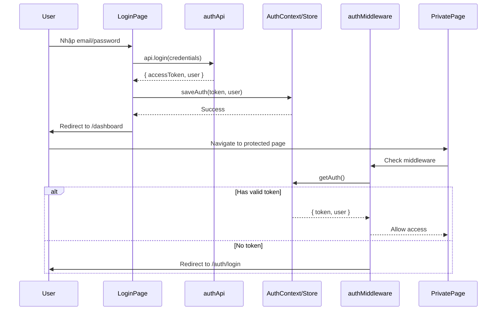

### 4. Modal Flow

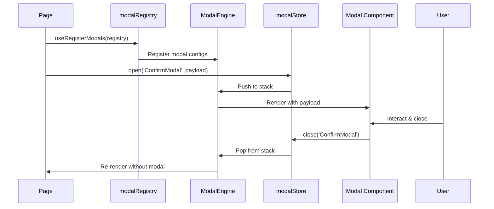

## Thêm Feature Mới

### Step-by-step Guide

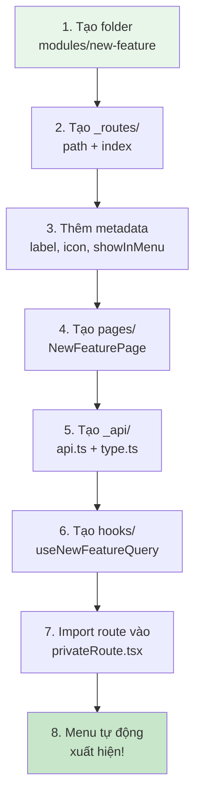

### Example: Thêm "Products" feature

```bash
# 1. Tạo structure
mkdir -p src/modules/products/{_api,_routes,components,hooks,pages,utils}

# 2. Tạo path constants
# modules/products/_routes/path.ts
class ProductUrls {
  static readonly ROOT = "/products";
  static readonly DETAIL = (id: string) => `${ProductUrls.ROOT}/${id}`;
}
export default ProductUrls;

# 3. Tạo route với metadata
# modules/products/_routes/index.tsx
import { Inventory } from "@mui/icons-material";
import type { RouteWithMeta } from "@shared/types/route.type";
import ProductsPage from "../pages/ProductsPage";
import ProductUrls from "./path";

const productsRoute: RouteWithMeta = {
  path: ProductUrls.ROOT,
  element: <ProductsPage />,
  meta: {
    label: "Products",
    icon: <Inventory />,
    showInMenu: true,
    order: 3,
  },
};
export default productsRoute;

# 4. Tạo API layer
# modules/products/_api/products.api.ts
import axiosInstance from "@core/axios";

export const productsApi = {
  getAll: async () => {
    const res = await axiosInstance.get('/products');
    return res.data;
  },
};

# 5. Tạo hook
# modules/products/hooks/useProducts.ts
import { useQuery } from "@tanstack/react-query";
import { productsApi } from "../_api/products.api";

export const useProducts = () => {
  return useQuery({
    queryKey: ['products'],
    queryFn: productsApi.getAll,
  });
};

# 6. Tạo page
# modules/products/pages/ProductsPage.tsx
import { useProducts } from "../hooks/useProducts";

function ProductsPage() {
  const { data, isLoading } = useProducts();
  if (isLoading) return <div>Loading...</div>;
  return <div>Products: {data.length}</div>;
}
export default ProductsPage;

# 7. Import vào privateRoute
# routes/privateRoute.tsx
import productsRoute from "@modules/products/_routes";

export const privateRouteChildren: RouteWithMeta[] = [
  dashboardRoute,
  settingsRoute,
  productsRoute,  // ← Thêm dòng này
];
```

**Kết quả**: Menu tự động có thêm "Products" với icon, đúng thứ tự!

## Best Practices

### 1. Route Metadata

```typescript
// ✅ GOOD: Đầy đủ metadata
const route: RouteWithMeta = {
  path: "/dashboard",
  element: <DashboardPage />,
  meta: {
    label: "Dashboard",
    icon: <Dashboard />,
    showInMenu: true,
    order: 1,
    roles: ["admin", "user"],
  },
};

// ❌ BAD: Thiếu metadata, hard-code menu sau
const route = {
  path: "/dashboard",
  element: <DashboardPage />,
};
```

### 2. API Layer

```typescript
// ✅ GOOD: Tách API ra file riêng
// modules/products/_api/products.api.ts
export const productsApi = {
  getAll: async () => axiosInstance.get('/products'),
  getById: async (id: string) => axiosInstance.get(`/products/${id}`),
};

// modules/products/hooks/useProducts.ts
export const useProducts = () => {
  return useQuery({
    queryKey: ['products'],
    queryFn: productsApi.getAll,
  });
};

// ❌ BAD: API call trực tiếp trong component
function ProductsPage() {
  const [data, setData] = useState([]);
  useEffect(() => {
    axiosInstance.get('/products').then(res => setData(res.data));
  }, []);
}
```

### 3. Module Independence

```typescript
// ✅ GOOD: Feature tự túc
modules/products/
├── _api/products.api.ts
├── hooks/useProducts.ts
└── pages/ProductsPage.tsx

// ❌ BAD: Phụ thuộc feature khác
// modules/products/pages/ProductsPage.tsx
import { useOrders } from "@modules/orders/hooks/useOrders"; // ❌
```

### 4. Shared vs Feature

```typescript
// ✅ GOOD: Shared chỉ chứa primitives
shared/components/Button.tsx
shared/hooks/useDebounce.ts

// ❌ BAD: Business logic trong shared
shared/hooks/useProducts.ts  // ❌ Nên ở modules/products/hooks/
shared/components/ProductCard.tsx  // ❌ Nên ở modules/products/components/
```

## Testing Strategy

### Testing Pyramid theo Clean Architecture

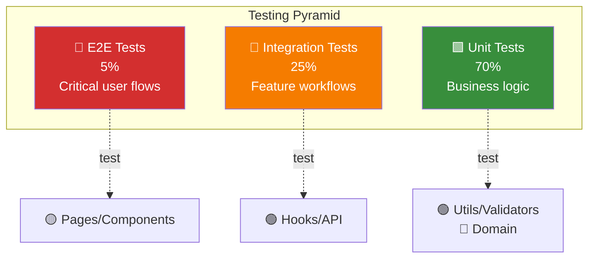

### Test Coverage theo Layer

| Layer | Test Type | Coverage | Tools | Example |
|-------|-----------|----------|-------|---------|
| 🔵 **Domain** | Unit | ~100% | Vitest | Type guards, business rules |
| 🟢 **Use Cases** | Unit + Integration | ~90% | Vitest + MSW | Hooks, API calls, validators |
| 🟡 **Adapters** | Integration | ~70% | RTL + Vitest | Components, pages |
| 🔴 **Frameworks** | E2E | ~5% | Playwright | Critical flows |

### Example: Testing Products Module

```
modules/products/__tests__/
├── unit/
│   ├── validations.test.ts       # 🔵 Domain: Business rules
│   ├── mappers.test.ts            # 🟢 Use Cases: Transformations
│   └── ProductRules.test.ts       # 🔵 Domain: Invariants
│
├── integration/
│   ├── hooks/
│   │   ├── useProducts.test.ts    # 🟢 Use Cases: Data fetching
│   │   └── useCreateProduct.test.ts
│   ├── api/
│   │   └── products.api.test.ts   # 🟢 Use Cases: API gateway
│   └── components/
│       ├── ProductForm.test.tsx   # 🟡 Adapters: UI + logic
│       └── ProductCard.test.tsx   # 🟡 Adapters: Presentation
│
└── e2e/
    └── product-crud.spec.ts       # 🔴 End-to-end: Full flow
```

### Test Examples

**1. Unit Test - Domain Layer (Business Rules)**

```typescript
// modules/products/__tests__/unit/ProductRules.test.ts
import { describe, it, expect } from 'vitest';
import { ProductRules } from '../../types/Product.type';
import { productSchema } from '../../utils/validations';

describe('Product Business Rules', () => {
  it('should enforce minimum price', () => {
    const result = productSchema.safeParse({
      name: 'Test Product',
      price: -10, // Invalid
      stock: 5,
      category: 'electronics'
    });
    
    expect(result.success).toBe(false);
    expect(result.error?.issues[0].message).toContain('Price must be >= 0');
  });
  
  it('should enforce max name length', () => {
    const longName = 'a'.repeat(ProductRules.MAX_NAME_LENGTH + 1);
    const result = productSchema.safeParse({
      name: longName,
      price: 100,
      stock: 5,
      category: 'electronics'
    });
    
    expect(result.success).toBe(false);
  });
});
```

**2. Integration Test - Use Case Layer (Hook)**

```typescript
// modules/products/__tests__/integration/hooks/useProducts.test.ts
import { renderHook, waitFor } from '@testing-library/react';
import { QueryClient, QueryClientProvider } from '@tanstack/react-query';
import { http, HttpResponse } from 'msw';
import { setupServer } from 'msw/node';
import { useProducts } from '../../../hooks/useProducts';
import type { ProductDTO } from '../../../_api/products.type';

const mockProducts: ProductDTO[] = [
  {
    id: '1',
    name: 'Laptop',
    price: 1000,
    stock: 10,
    category: 'electronics',
    created_at: '2024-01-01T00:00:00Z',
  },
];

const server = setupServer(
  http.get('/api/products', () => {
    return HttpResponse.json(mockProducts);
  })
);

beforeAll(() => server.listen());
afterEach(() => server.resetHandlers());
afterAll(() => server.close());

describe('useProducts', () => {
  it('should fetch and transform products', async () => {
    const queryClient = new QueryClient({
      defaultOptions: { queries: { retry: false } },
    });
    
    const wrapper = ({ children }) => (
      <QueryClientProvider client={queryClient}>
        {children}
      </QueryClientProvider>
    );
    
    const { result } = renderHook(() => useProducts(), { wrapper });
    
    await waitFor(() => expect(result.current.isSuccess).toBe(true));
    
    expect(result.current.data).toHaveLength(1);
    expect(result.current.data[0].name).toBe('Laptop');
    // Verify transformation: created_at → createdAt
    expect(result.current.data[0].createdAt).toBeInstanceOf(Date);
  });
  
  it('should handle API errors', async () => {
    server.use(
      http.get('/api/products', () => {
        return HttpResponse.json(
          { message: 'Internal Server Error' },
          { status: 500 }
        );
      })
    );
    
    const queryClient = new QueryClient({
      defaultOptions: { queries: { retry: false } },
    });
    
    const wrapper = ({ children }) => (
      <QueryClientProvider client={queryClient}>
        {children}
      </QueryClientProvider>
    );
    
    const { result } = renderHook(() => useProducts(), { wrapper });
    
    await waitFor(() => expect(result.current.isError).toBe(true));
    expect(result.current.error).toBeDefined();
  });
});
```

**3. Integration Test - Adapter Layer (Component)**

```typescript
// modules/products/__tests__/integration/components/ProductForm.test.tsx
import { render, screen, waitFor } from '@testing-library/react';
import userEvent from '@testing-library/user-event';
import { describe, it, expect, vi } from 'vitest';
import ProductForm from '../../../components/ProductForm';

describe('ProductForm', () => {
  it('should validate and submit form', async () => {
    const onSubmit = vi.fn();
    const user = userEvent.setup();
    
    render(<ProductForm onSubmit={onSubmit} />);
    
    // Fill form
    await user.type(screen.getByLabelText(/name/i), 'New Product');
    await user.type(screen.getByLabelText(/price/i), '99.99');
    await user.type(screen.getByLabelText(/stock/i), '10');
    
    // Submit
    await user.click(screen.getByRole('button', { name: /save/i }));
    
    await waitFor(() => {
      expect(onSubmit).toHaveBeenCalledWith({
        name: 'New Product',
        price: 99.99,
        stock: 10,
      });
    });
  });
  
  it('should show validation errors', async () => {
    const onSubmit = vi.fn();
    const user = userEvent.setup();
    
    render(<ProductForm onSubmit={onSubmit} />);
    
    // Submit empty form
    await user.click(screen.getByRole('button', { name: /save/i }));
    
    // Check validation messages
    expect(await screen.findByText(/name required/i)).toBeInTheDocument();
    expect(onSubmit).not.toHaveBeenCalled();
  });
});
```

**4. E2E Test - Full User Flow**

```typescript
// e2e/products/crud.spec.ts (Playwright)
import { test, expect } from '@playwright/test';

test.describe('Product CRUD Flow', () => {
  test('should create, view, edit, and delete product', async ({ page }) => {
    // Login first
    await page.goto('/auth/login');
    await page.fill('[name="email"]', 'admin@example.com');
    await page.fill('[name="password"]', 'password123');
    await page.click('button[type="submit"]');
    
    // Navigate to products
    await page.goto('/products');
    await expect(page.locator('h1')).toContainText('Products');
    
    // Create new product
    await page.click('button:has-text("Add Product")');
    await page.fill('[name="name"]', 'E2E Test Product');
    await page.fill('[name="price"]', '149.99');
    await page.fill('[name="stock"]', '20');
    await page.click('button:has-text("Save")');
    
    // Verify created
    await expect(page.locator('text=E2E Test Product')).toBeVisible();
    
    // Edit product
    await page.click('text=E2E Test Product');
    await page.click('button:has-text("Edit")');
    await page.fill('[name="price"]', '199.99');
    await page.click('button:has-text("Save")');
    
    // Verify edited
    await expect(page.locator('text=$199.99')).toBeVisible();
    
    // Delete product
    await page.click('button:has-text("Delete")');
    await page.click('button:has-text("Confirm")');
    
    // Verify deleted
    await expect(page.locator('text=E2E Test Product')).not.toBeVisible();
  });
});
```

### Test Coverage Goals

| Layer | Target Coverage | Why |
|-------|----------------|-----|
| Domain (types, rules) | 100% | Core business logic must be bulletproof |
| Use Cases (hooks, utils) | 90% | Critical application logic |
| Adapters (components) | 70% | UI có thể thay đổi, focus vào logic |
| E2E | 5-10% | Slow & brittle, chỉ test happy paths quan trọng |

### CI/CD Test Pipeline

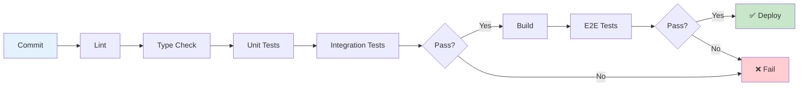

```
Feature Layer Testing:
├── Unit Tests          → hooks/, utils/, api/
├── Integration Tests   → pages/ with mocked APIs
└── E2E Tests          → Critical user flows

Infrastructure Tests:
├── Unit Tests          → extractMenuFromRoutes, middleware
└── Integration Tests   → Route guards, modal engine
```

## Cross-Cutting Concerns

Một số concerns (logging, caching, error handling, auth) xuyên suốt nhiều layers. Clean Architecture xử lý bằng **Dependency Inversion**:

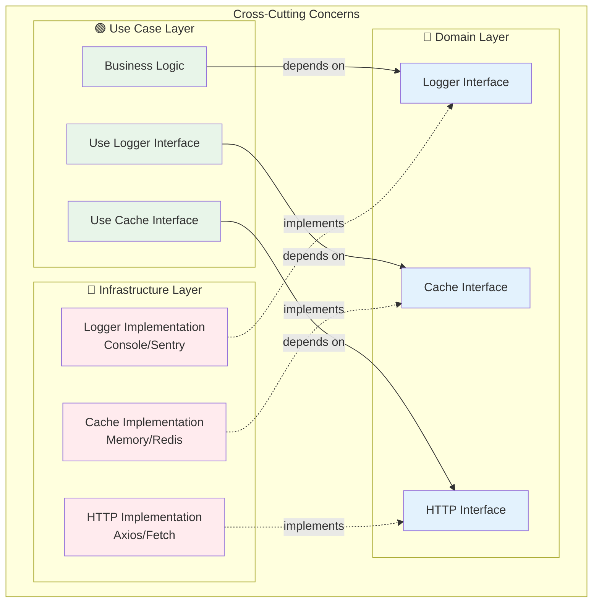

### 1. Error Handling

**Domain Layer** - Error types:
```typescript
// shared/types/errors.type.ts (Domain)
export class ValidationError extends Error {
  constructor(message: string, public field: string) {
    super(message);
    this.name = 'ValidationError';
  }
}

export class NotFoundError extends Error {
  constructor(resource: string, id: string) {
    super(`${resource} with id ${id} not found`);
    this.name = 'NotFoundError';
  }
}
```

**Infrastructure Layer** - Error handling:
```typescript
// @core/axios/index.ts (Infrastructure)
import { NotFoundError } from '@shared/types/errors.type';

axiosInstance.interceptors.response.use(
  response => response,
  error => {
    if (error.response?.status === 404) {
      throw new NotFoundError('Resource', error.config.url);
    }
    throw error;
  }
);
```

**Adapter Layer** - Error display:
```typescript
// modules/products/pages/ProductsPage.tsx (Adapter)
import { NotFoundError } from '@shared/types/errors.type';

function ProductsPage() {
  const { data, error } = useProducts();
  
  if (error instanceof NotFoundError) {
    return <NotFoundUI message={error.message} />;
  }
  
  if (error) {
    return <ErrorUI error={error} />;
  }
  
  return <ProductList data={data} />;
}
```

### 2. Logging

**Domain** - Logger interface:
```typescript
// shared/types/logger.interface.ts (Domain)
export interface ILogger {
  info(message: string, meta?: Record<string, any>): void;
  error(message: string, error?: Error, meta?: Record<string, any>): void;
  warn(message: string, meta?: Record<string, any>): void;
}
```

**Infrastructure** - Implementation:
```typescript
// @core/logger/ConsoleLogger.ts (Infrastructure)
import type { ILogger } from '@shared/types/logger.interface';

export class ConsoleLogger implements ILogger {
  info(message: string, meta?: Record<string, any>) {
    console.log(`[INFO] ${message}`, meta);
  }
  
  error(message: string, error?: Error, meta?: Record<string, any>) {
    console.error(`[ERROR] ${message}`, error, meta);
  }
  
  warn(message: string, meta?: Record<string, any>) {
    console.warn(`[WARN] ${message}`, meta);
  }
}

// @core/logger/index.ts
export const logger: ILogger = new ConsoleLogger();
// Có thể swap với SentryLogger, CloudWatchLogger, etc.
```

**Use Case** - Sử dụng:
```typescript
// modules/products/_api/products.api.ts (Use Case)
import { logger } from '@core/logger';

export const productsApi = {
  getAll: async () => {
    try {
      logger.info('Fetching products');
      const res = await axiosInstance.get('/products');
      logger.info('Products fetched', { count: res.data.length });
      return res.data;
    } catch (error) {
      logger.error('Failed to fetch products', error);
      throw error;
    }
  },
};
```

### 3. Caching Strategy

**Infrastructure** - Cache implementation:
```typescript
// @core/cache/QueryCache.ts (Infrastructure)
import { QueryClient } from '@tanstack/react-query';

export const queryClient = new QueryClient({
  defaultOptions: {
    queries: {
      staleTime: 5 * 60 * 1000, // 5 minutes
      gcTime: 10 * 60 * 1000, // 10 minutes
      refetchOnWindowFocus: false,
      retry: 1,
    },
  },
});
```

**Use Case** - Cache invalidation:
```typescript
// modules/products/hooks/useCreateProduct.ts (Use Case)
import { useMutation, useQueryClient } from '@tanstack/react-query';

export const useCreateProduct = () => {
  const queryClient = useQueryClient();
  
  return useMutation({
    mutationFn: productsApi.create,
    onSuccess: (newProduct) => {
      // Invalidate to refetch
      queryClient.invalidateQueries({ queryKey: ['products'] });
      
      // Or optimistic update
      queryClient.setQueryData(['products'], (old: Product[]) => {
        return [...old, newProduct];
      });
    },
  });
};
```

### 4. Authentication

**Domain** - Auth types:
```typescript
// shared/types/auth.type.ts (Domain)
export interface User {
  id: string;
  email: string;
  name: string;
  roles: string[];
}

export interface AuthState {
  user: User | null;
  accessToken: string | null;
  isAuthenticated: boolean;
}
```

**Infrastructure** - Auth provider:
```typescript
// @core/providers/AuthProvider.tsx (Infrastructure)
import { create } from 'zustand';
import { persist } from 'zustand/middleware';
import type { AuthState, User } from '@shared/types/auth.type';

export const useAuthStore = create<AuthState>()(
  persist(
    (set) => ({
      user: null,
      accessToken: null,
      isAuthenticated: false,
      
      setAuth: (user: User, accessToken: string) => {
        set({ user, accessToken, isAuthenticated: true });
      },
      
      clearAuth: () => {
        set({ user: null, accessToken: null, isAuthenticated: false });
      },
    }),
    { name: 'auth-storage' }
  )
);
```

**Middleware** - Route guard:
```typescript
// @core/middlewares/auth.ts (Infrastructure)
import { redirect } from 'react-router';
import { useAuthStore } from '@core/providers/AuthProvider';

export const authMiddleware = async () => {
  const { isAuthenticated } = useAuthStore.getState();
  
  if (!isAuthenticated) {
    throw redirect('/auth/login');
  }
  
  return null;
};
```

## Migration Guide

Nếu có code cũ vi phạm dependency rules:

### Problem 1: Core import modules

```typescript
// ❌ BEFORE: @core import modules
// @core/app-shell/hooks/useGetMenuList.tsx
import DashboardUrls from "@modules/dashboard/_routes/path";

// ✅ AFTER: Core chỉ extract từ routes
// routes/privateRoute.tsx
export const privateRouteChildren = [dashboardRoute, ...];

// @core/app-shell/hooks/useGetMenuList.tsx
import { privateRouteChildren } from "@routes/privateRoute";
const menu = extractMenuFromRoutes(privateRouteChildren);
```

### Problem 2: Shared có business logic

```typescript
// ❌ BEFORE: shared có feature logic
shared/services/auth/auth.api.ts

// ✅ AFTER: Di chuyển về feature
modules/auth/_api/auth.api.ts
```

## Tài liệu tham khảo

### Clean Architecture
- [Clean Architecture (Uncle Bob)](https://blog.cleancoder.com/uncle-bob/2012/08/13/the-clean-architecture.html)
- [The Clean Code Blog](https://blog.cleancoder.com/)
- [Clean Architecture Book](https://www.amazon.com/Clean-Architecture-Craftsmans-Software-Structure/dp/0134494164)

### Frontend Architecture
- [Feature-Sliced Design](https://feature-sliced.design/)
- [React Query Best Practices](https://tkdodo.eu/blog/practical-react-query)
- [Module Independence](https://martinfowler.com/articles/modular-monolith.html)
- [Domain-Driven Design](https://martinfowler.com/bliki/DomainDrivenDesign.html)

### Testing
- [Testing Library](https://testing-library.com/docs/react-testing-library/intro/)
- [MSW (Mock Service Worker)](https://mswjs.io/)
- [Testing Best Practices](https://kentcdodds.com/blog/common-mistakes-with-react-testing-library)

### Internal Docs
- [DEPENDENCY_RULES.md](./DEPENDENCY_RULES.md) - Chi tiết quy tắc import
- [MODULE_TEMPLATE.md](./MODULE_TEMPLATE.md) - Template tạo module mới
- [CLEAN_ARCHITECTURE_SUMMARY.md](./CLEAN_ARCHITECTURE_SUMMARY.md) - Tóm tắt Clean Architecture
