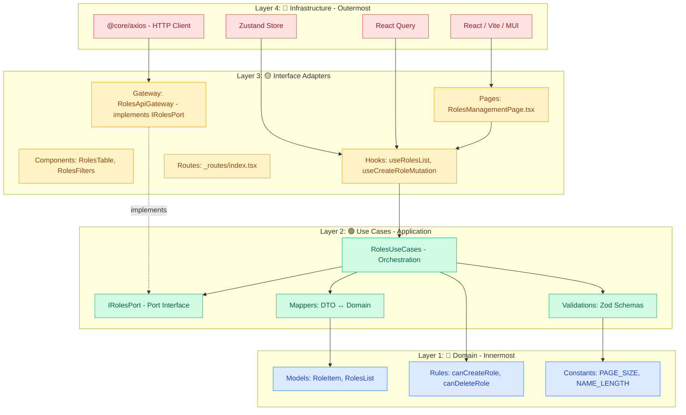
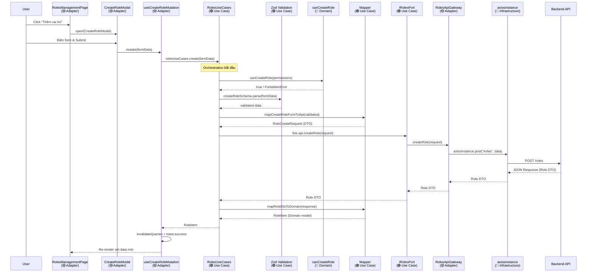
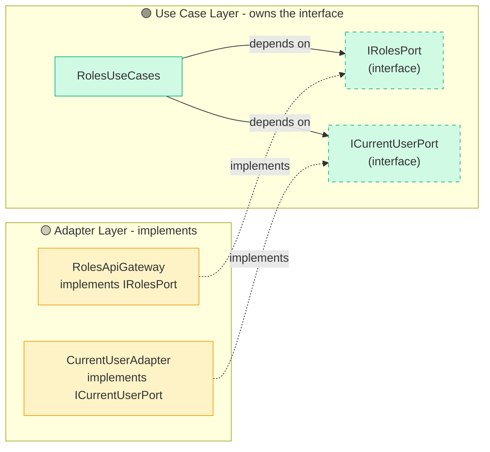
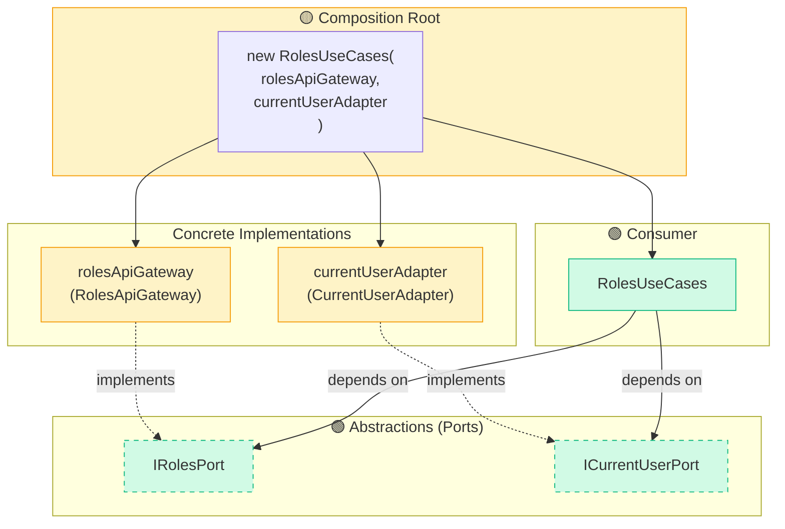
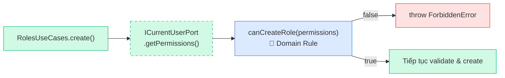
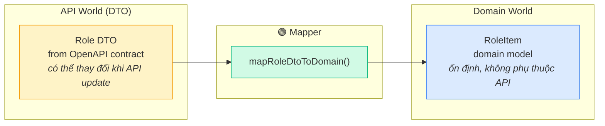
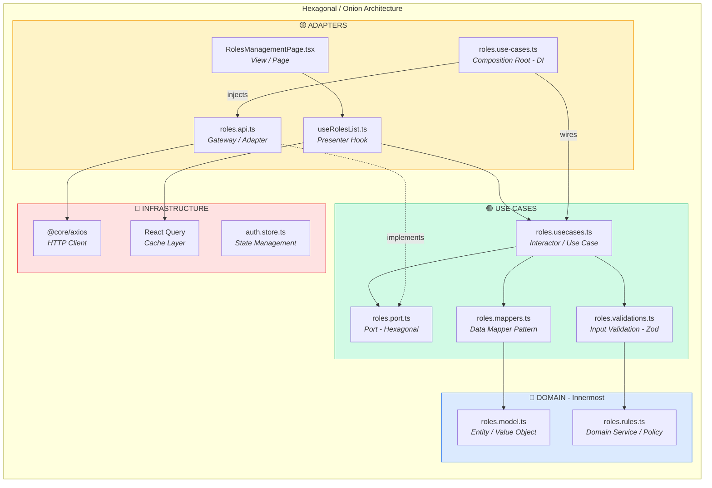

# Clean Architecture Deep Dive — Module `roles_permissions`

> Luồng đi từ Infrastructure vào Domain, Ports & Adapters, Hexagonal, Onion Architecture

## Mục lục

- [1. Onion Architecture Overview](#1-onion-architecture-overview)
- [2. Luồng đi chi tiết: Infrastructure → Domain](#2-luồng-đi-chi-tiết-infrastructure--domain)
  - [2.1. Request Flow: Lấy danh sách Roles](#21-request-flow-lấy-danh-sách-roles)
  - [2.2. Response Flow (ngược lại)](#22-response-flow-ngược-lại)
  - [2.3. Sequence Diagram: Tạo Role mới](#23-sequence-diagram-tạo-role-mới)
- [3. Port & Adapter Pattern (Hexagonal Architecture)](#3-port--adapter-pattern-hexagonal-architecture)
  - [3.1. Port — Định nghĩa bởi Use Case layer](#31-port--định-nghĩa-bởi-use-case-layer)
  - [3.2. Adapter (Gateway) — Implement Port](#32-adapter-gateway--implement-port)
  - [3.3. Use Cases — Chỉ phụ thuộc Port](#33-use-cases--chỉ-phụ-thuộc-port)
  - [3.4. Dependency Inversion Diagram](#34-dependency-inversion-diagram)
- [4. Composition Root — Nơi kết nối tất cả](#4-composition-root--nơi-kết-nối-tất-cả)
- [5. ICurrentUserPort — Cross-cutting Port cho Authorization](#5-icurrentuserport--cross-cutting-port-cho-authorization)
- [6. Data Mapper Pattern](#6-data-mapper-pattern)
- [7. Domain Layer — Lõi thuần túy](#7-domain-layer--lõi-thuần-túy)
- [8. Chi tiết từng Layer với File tương ứng](#8-chi-tiết-từng-layer-với-file-tương-ứng)
- [9. Tổng hợp các Pattern và vị trí áp dụng](#9-tổng-hợp-các-pattern-và-vị-trí-áp-dụng)
- [10. Shared Infrastructure & Cross-cutting Concerns](#10-shared-infrastructure--cross-cutting-concerns)
- [11. Lợi ích của kiến trúc này](#11-lợi-ích-của-kiến-trúc-này)

---

## 1. Onion Architecture Overview

Dự án sử dụng **Onion Architecture** (đồng tâm), trong đó dependencies **chỉ đi từ ngoài vào trong**. Inner layers (Domain, Use Cases) không bao giờ import từ outer layers (Adapters, Infrastructure).



**Golden Rule**:

> Source code dependencies **CHỈ được phép đi TỪ NGOÀI VÀO TRONG**.
> Domain không bao giờ import từ Use Cases.
> Use Cases không bao giờ import từ Adapters hay Infrastructure.

```
🔴 Infrastructure ──depends on──▶ 🟡 Adapters ──depends on──▶ 🟢 Use Cases ──depends on──▶ 🔵 Domain
      (Detail)                      (Interface)                   (Logic)                    (Policy)

   ❌ Inner circles KHÔNG THỂ import outer circles
   ✅ Outer circles CÓ THỂ import inner circles
```

---

## 2. Luồng đi chi tiết: Infrastructure → Domain

### 2.1. Request Flow: Lấy danh sách Roles

Theo dõi một request "Lấy danh sách Roles" từ khi User click cho đến khi data hiển thị:

```
Step  Layer              File                                    Hành động
───── ────────────────── ─────────────────────────────────────── ──────────────────────────────────────
 01   🔴 Infrastructure  React renders component                 User mở trang, React/MUI/React Query
                                                                 cung cấp framework runtime

 02   🟡 Adapter          pages/RolesManagementPage.tsx           useState(filters), gọi useRolesList(filters),
                                                                 render RolesTable

 03   🟡 Adapter          hooks/useRolesList.ts                   useQuery gọi rolesUseCases.getList(filters)
                                                                 Caching, stale time được cấu hình tại đây

 04   🟢 Use Case         _usecases/roles/roles.usecases.ts      Validate filters (Zod) → map to API params
                                                                 → gọi this.api.listRoles() → map response to domain

 05   🟢 Use Case         _usecases/roles/roles.port.ts          IRolesPort.listRoles() — Use Case chỉ biết
                                                                 interface này, KHÔNG biết HTTP

 06   🟡 Adapter          _api/roles/roles.api.ts                 RolesApiGateway implements IRolesPort
                                                                 Gọi axiosInstance.get('/roles', {params})

 07   🔴 Infrastructure  @core/axios/index.ts                    Axios instance thực hiện HTTP request,
                                                                 attach Bearer token, handle interceptors
```

### 2.2. Response Flow (ngược lại)

```
Step  Layer              Hành động
───── ────────────────── ──────────────────────────────────────────────────────────────────────
 A    🔴 Infrastructure  API trả về JSON → Axios parse → RoleListResponse (DTO)
 B    🟡 Adapter          RolesApiGateway trả về RoleListResponse cho Use Case
 C    🟢 Use Case         Mapper: mapRoleDtosToDomain() chuyển Role DTO → RoleItem domain model
 D    🟢 Use Case         RolesUseCases trả về RolesList {data: RoleItem[], meta} cho Hook
 E    🟡 Adapter          useRolesList trả về {data, isLoading, isError} cho Page
 F    🟡 Adapter          RolesTable nhận RoleItem[] và PaginationMeta, render bảng MUI
```

### 2.3. Sequence Diagram: Tạo Role mới



---

## 3. Port & Adapter Pattern (Hexagonal Architecture)

Đây là pattern cốt lõi của dự án. **Port** là interface định nghĩa trong Use Case layer. **Adapter** là class bên ngoài implement port đó.

### 3.1. Port — Định nghĩa bởi Use Case layer

```typescript
// _usecases/roles/roles.port.ts — 🟢 USE CASE LAYER
export interface IRolesPort {
  listRoles(params: RoleListRequest): Promise<RoleListResponse>;
  createRole(data: RoleCreateRequest): Promise<Role>;
  getRoleById(roleId: string): Promise<Role>;
  updateRole(payload: RoleUpdateRequestBody): Promise<Role>;
  deleteRole(roleId: string): Promise<void>;
  getRolePermissions(roleId: string): Promise<PermissionListResponse>;
  setRolePermissions(
    roleId: string,
    data: RolePermissionsUpdateRequest
  ): Promise<PermissionListResponse>;
}
```

> **Quan trọng**: Port nằm trong **Use Case layer** (inner), KHÔNG phải Adapter layer. Use Cases **sở hữu** interface này. Gateway (outer) chỉ implement nó.

### 3.2. Adapter (Gateway) — Implement Port

```typescript
// _api/roles/roles.api.ts — 🟡 GATEWAY LAYER
export class RolesApiGateway implements IRolesPort {
  async listRoles(params: RoleListRequest): Promise<RoleListResponse> {
    const response = await axiosInstance.get<RoleListResponse>(
      RolesApiRoutes.Roles,
      { params }
    );
    return response.data;
  }

  async createRole(data: RoleCreateRequest): Promise<Role> {
    const response = await axiosInstance.post<Role>(RolesApiRoutes.Roles, data);
    return response.data;
  }

  // ... other methods follow same pattern
}

export const rolesApiGateway = new RolesApiGateway();
```

### 3.3. Use Cases — Chỉ phụ thuộc Port

```typescript
// _usecases/roles/roles.usecases.ts — 🟢 USE CASE LAYER
export class RolesUseCases {
  private readonly api: IRolesPort; // ← Port interface, KHÔNG phải concrete class
  private readonly currentUser: ICurrentUserPort | null;

  constructor(api: IRolesPort, currentUser: ICurrentUserPort | null = null) {
    this.api = api;
    this.currentUser = currentUser;
  }

  async getList(filters: RolesFilters): Promise<RolesList> {
    const validated = rolesFiltersSchema.parse(filters); // 1. Validate
    const params = mapFiltersToRoleListRequest(validated); // 2. Map to DTO
    const response = await this.api.listRoles(params); // 3. Gọi Port
    return {
      data: mapRoleDtosToDomain(response.data), // 4. Map to Domain
      meta: response.meta,
    };
  }

  async create(formData: CreateRoleSchema): Promise<RoleItem> {
    if (this.currentUser && !canCreateRole(this.getPermissions()))
      throw new ForbiddenError("Bạn không có quyền tạo vai trò"); // 1. Authz check
    const validated = createRoleSchema.parse(formData); // 2. Validate
    const request = mapCreateRoleFormToApi(validated); // 3. Map to DTO
    const response = await this.api.createRole(request); // 4. Gọi Port
    return mapRoleDtoToDomain(response); // 5. Map to Domain
  }
}
```

### 3.4. Dependency Inversion Diagram



**Tại sao dùng Port?**

- Use Cases cần gọi API nhưng **KHÔNG muốn biết chi tiết** HTTP, Axios, hay REST endpoints
- Khi **test**: thay Gateway bằng mock → `new RolesUseCases(mockGateway)`
- Khi **đổi API** (REST → GraphQL): chỉ cần viết Gateway mới implement IRolesPort, Use Cases không thay đổi gì

---

## 4. Composition Root — Nơi kết nối tất cả

```typescript
// roles/hooks/roles.use-cases.ts — 🟡 ADAPTER (Composition Root)
import { rolesApiGateway } from "@modules/roles_permissions/_api/roles/roles.api";
import { RolesUseCases } from "@modules/roles_permissions/_usecases/roles/roles.usecases";
import { currentUserAdapter } from "@shared/adapters/current-user.adapter";

export const rolesUseCases = new RolesUseCases(
  rolesApiGateway, // ← Concrete HTTP adapter
  currentUserAdapter // ← Concrete Zustand adapter
);
```

Đây là **Composition Root** — điểm duy nhất nơi tất cả dependencies được "wire" lại với nhau (Manual Dependency Injection). Nó nằm ở tầng Adapter (outer), nơi có quyền biết về tất cả các concrete implementations.



---

## 5. ICurrentUserPort — Cross-cutting Port cho Authorization

Tương tự `IRolesPort`, `ICurrentUserPort` là một **shared port** cho phép Use Cases kiểm tra quyền mà **không phụ thuộc vào Zustand**:

```typescript
// shared/ports/current-user.port.ts — 🟢 Port (shared across modules)
export interface ICurrentUserPort {
  getPermissions(): string[];
  getUserId(): string | null;
}
```

Adapter implement nó bằng cách đọc Zustand store:

```typescript
// shared/adapters/current-user.adapter.ts — 🟡 Adapter
export class CurrentUserAdapter implements ICurrentUserPort {
  getPermissions(): string[] {
    return useAuthStore.getState().permissions;
  }

  getUserId(): string | null {
    return useAuthStore.getState().userId;
  }
}

export const currentUserAdapter = new CurrentUserAdapter();
```

**Luồng Authorization trong Use Cases**:



---

## 6. Data Mapper Pattern

Mappers nằm trong **Use Case layer**, chuyển đổi giữa DTO (cấu trúc API) và Domain Model (cấu trúc nội bộ):

```typescript
// _usecases/roles/roles.mappers.ts — 🟢 USE CASE LAYER

// DTO → Domain: Khi nhận response từ API
export function mapRoleDtoToDomain(dto: Role): RoleItem {
  return {
    id: dto.id,
    tenantId: dto.tenantId,
    name: dto.name,
    description: dto.description ?? null,
    isSystem: dto.isSystem,
    permissionCount: dto.permissionCount ?? 0,
    permissions: undefined,
    createdAt: dto.createdAt,
    updatedAt: dto.updatedAt,
  };
}

// Domain Filters → API Request DTO: Khi gửi request
export function mapFiltersToRoleListRequest(
  filters: RolesFiltersSchema
): RoleListRequest {
  const result: RoleListRequest = {};
  if (filters.page != null) result.page = filters.page;
  if (filters.pageSize != null) result.pageSize = filters.pageSize;
  if (filters.search != null && filters.search !== "")
    result.search = filters.search;
  return result;
}

// Form → API Request DTO: Khi tạo mới
export function mapCreateRoleFormToApi(
  form: CreateRoleSchema
): RoleCreateRequest {
  return {
    name: form.name.trim(),
    description: form.description?.trim() || null,
    permissionIds: form.permissionIds ?? [],
  };
}
```

**Tại sao cần Mapper?**



Khi API thay đổi field name, **chỉ mapper cần cập nhật**. Domain và UI không bị ảnh hưởng.

---

## 7. Domain Layer — Lõi thuần túy

Domain là layer trong nhất, **không phụ thuộc bất kỳ outer layer nào**:

### Models (Entities / Value Objects)

```typescript
// _domain/roles/roles.model.ts — 🔵 DOMAIN LAYER
// Pure domain types — NO imports from _api or any outer layer

export interface RoleItem {
  id: string;
  tenantId: string;
  name: string;
  description: string | null;
  isSystem: boolean;
  permissionCount: number;
  permissions?: PermissionItem[];
  createdAt: string;
  updatedAt: string;
}

export type RolesList = PaginatedResponse<RoleItem>;

export interface RolesFilters {
  page?: number;
  pageSize?: number;
  search?: string;
}
```

### Business Rules (Domain Services / Policies)

```typescript
// _domain/roles/roles.rules.ts — 🔵 DOMAIN LAYER

// Constants / Invariants
export const DEFAULT_PAGE = 1;
export const DEFAULT_PAGE_SIZE = 20;
export const ROLE_NAME_MIN_LENGTH = 2;
export const ROLE_NAME_MAX_LENGTH = 100;
export const ROLE_DESCRIPTION_MAX_LENGTH = 500;

// Authorization policies
export function canDeleteRole(permissions: string[]): boolean {
  return permissions.includes(ROLES_MANAGE);
}

export function canCreateRole(permissions: string[]): boolean {
  return permissions.includes(ROLES_MANAGE);
}

export function canEditRole(permissions: string[]): boolean {
  return permissions.includes(ROLES_MANAGE);
}
```

### Validations (sử dụng Domain Rules)

```typescript
// _usecases/roles/roles.validations.ts — 🟢 USE CASE LAYER
// Zod schemas IMPORT constants từ Domain Rules

import {
  ROLE_NAME_MIN_LENGTH,
  ROLE_NAME_MAX_LENGTH,
  ROLE_DESCRIPTION_MAX_LENGTH,
  DEFAULT_PAGE,
  DEFAULT_PAGE_SIZE,
  MIN_PAGE_SIZE,
  MAX_PAGE_SIZE,
  MIN_SEARCH_LENGTH,
} from "@modules/roles_permissions/_domain/roles/roles.rules";

export const createRoleSchema = z.object({
  name: z
    .string()
    .min(
      ROLE_NAME_MIN_LENGTH,
      `Tên vai trò tối thiểu ${ROLE_NAME_MIN_LENGTH} ký tự`
    )
    .max(
      ROLE_NAME_MAX_LENGTH,
      `Tên vai trò tối đa ${ROLE_NAME_MAX_LENGTH} ký tự`
    ),
  description: z
    .string()
    .max(ROLE_DESCRIPTION_MAX_LENGTH)
    .optional()
    .nullable(),
  permissionIds: z.array(z.string().uuid()).optional().default([]),
});
```

> **Lưu ý**: Validation schemas nằm ở Use Case layer nhưng **sử dụng constants từ Domain**. Domain rules là nguồn sự thật duy nhất (single source of truth) cho business constraints.

---

## 8. Chi tiết từng Layer với File tương ứng

| Layer       | File                                            | Vai trò                                                     | Pattern                           |
| ----------- | ----------------------------------------------- | ----------------------------------------------------------- | --------------------------------- |
| 🔵 Domain   | `_domain/roles/roles.model.ts`                  | RoleItem, RolesList, RolesFilters interfaces                | Entity / Value Object             |
| 🔵 Domain   | `_domain/roles/roles.rules.ts`                  | Business rules: canDeleteRole(), canCreateRole(), constants | Domain Service / Policy           |
| 🔵 Domain   | `_domain/permissions/permissions.model.ts`      | PermissionItem interface                                    | Entity                            |
| 🔵 Domain   | `_domain/permissions/permissions.rules.ts`      | PERMISSION_GROUPS, parsePermissionKey()                     | Domain Service                    |
| 🟢 Use Case | `_usecases/roles/roles.port.ts`                 | IRolesPort interface — định nghĩa contract                  | **Port (Hexagonal)**              |
| 🟢 Use Case | `_usecases/roles/roles.usecases.ts`             | RolesUseCases class — orchestration logic                   | **Interactor / Use Case**         |
| 🟢 Use Case | `_usecases/roles/roles.mappers.ts`              | DTO ↔ Domain transformations                                | **Data Mapper**                   |
| 🟢 Use Case | `_usecases/roles/roles.validations.ts`          | Zod schemas using domain rules                              | Input Validation                  |
| 🟢 Use Case | `_usecases/permissions/permissions.port.ts`     | IPermissionsPort interface                                  | **Port (Hexagonal)**              |
| 🟢 Use Case | `_usecases/permissions/permissions.usecases.ts` | PermissionsUseCases class                                   | Interactor                        |
| 🟢 Use Case | `_usecases/permissions/permissions.mappers.ts`  | Permission DTO → Domain mapper                              | Data Mapper                       |
| 🟡 Adapter  | `_api/roles/roles.api.ts`                       | RolesApiGateway implements IRolesPort                       | **Gateway / Adapter (Hexagonal)** |
| 🟡 Adapter  | `_api/roles/roles.type.ts`                      | DTOs from OpenAPI contract                                  | Data Transfer Object              |
| 🟡 Adapter  | `roles/hooks/roles.use-cases.ts`                | Composition Root — wiring dependencies                      | **Composition Root (DI)**         |
| 🟡 Adapter  | `roles/hooks/useRolesList.ts`                   | React Query wrapper gọi UseCases                            | Presenter Hook                    |
| 🟡 Adapter  | `roles/hooks/useCreateRoleMutation.ts`          | Mutation hook gọi UseCases.create()                         | Presenter Hook                    |
| 🟡 Adapter  | `roles/pages/RolesManagementPage.tsx`           | Page component — UI container                               | View / Page                       |
| 🟡 Adapter  | `roles/components/RolesTable.tsx`               | Table UI nhận domain models                                 | Presentational Component          |
| 🟡 Adapter  | `roles/components/RolesFilters.tsx`             | Filter UI component                                         | Presentational Component          |
| 🟡 Adapter  | `roles/modals/CreateRoleModal.tsx`              | Modal for creating roles                                    | Presentational Component          |
| 🔴 Infra    | `@core/axios/index.ts`                          | Axios instance, interceptors, token refresh                 | HTTP Client                       |
| 🔴 Infra    | `@shared/stores/auth.store.ts`                  | Zustand auth state                                          | State Management                  |

---

## 9. Tổng hợp các Pattern và vị trí áp dụng



| Pattern                            | Vị trí áp dụng                                           | Mục đích                                                                                         |
| ---------------------------------- | -------------------------------------------------------- | ------------------------------------------------------------------------------------------------ |
| **Hexagonal Architecture**         | Toàn bộ cấu trúc module                                  | Application core (Domain + Use Cases) được bao bọc bởi Ports. Adapters kết nối với thế giới thật |
| **Port & Adapter**                 | `roles.port.ts` (Port) / `roles.api.ts` (Adapter)        | Dependency Inversion — Use Cases không biết về HTTP                                              |
| **Onion Architecture**             | 4 layers: Domain → Use Cases → Adapters → Infrastructure | Dependencies chỉ đi vào trong                                                                    |
| **Dependency Inversion (SOLID-D)** | `RolesUseCases → IRolesPort ← RolesApiGateway`           | High-level không phụ thuộc low-level                                                             |
| **Composition Root**               | `roles.use-cases.ts`                                     | Điểm duy nhất wire tất cả dependencies (Manual DI)                                               |
| **Data Mapper**                    | `roles.mappers.ts`                                       | Chuyển đổi DTO ↔ Domain Model, giữ domain độc lập với API                                        |
| **Input Validation**               | `roles.validations.ts` (Zod + Domain Rules)              | Validate data trước khi xử lý, schema dùng constants từ Domain                                   |
| **Query Key Factory**              | `RolesKeys` trong `useRolesList.ts`                      | Consistent cache invalidation với React Query                                                    |
| **Authorization in Use Case**      | `canCreateRole()` gọi trong `RolesUseCases`              | Authz logic nằm trong business layer, không ở UI                                                 |
| **Modal Registry**                 | `roles.modal.registry.tsx`                               | Declarative modal management qua Zustand                                                         |

---

## 10. Shared Infrastructure & Cross-cutting Concerns

| Concern                  | Location                                   | Mô tả                                                                                    |
| ------------------------ | ------------------------------------------ | ---------------------------------------------------------------------------------------- |
| **HTTP Client**          | `@core/axios/index.ts`                     | Axios instance với cookie auth, request/response interceptors, auto token refresh on 401 |
| **OpenAPI Types**        | `@core/api-contract/openapi.ts`            | Auto-generated types từ swagger.json. Tất cả DTOs xuất phát từ đây                       |
| **Auth State**           | `@shared/stores/auth.store.ts`             | Zustand store: userId, permissions. Persist qua storage middleware                       |
| **Current User Port**    | `@shared/ports/current-user.port.ts`       | ICurrentUserPort interface — shared across all modules cho authz                         |
| **Current User Adapter** | `@shared/adapters/current-user.adapter.ts` | CurrentUserAdapter đọc Zustand store, implement ICurrentUserPort                         |
| **Modal System**         | `@core/modal/`                             | Zustand-based modal registry + stack. ModalEngine renders, useModalController controls   |
| **Shared UI**            | `@shared/components/`                      | BaseTable, BaseModal, BaseTextFieldForm, BasePagination — dùng chung toàn app            |
| **Error Types**          | `@shared/errors/app.errors.ts`             | ForbiddenError, NotFoundError, ValidationError — domain-level errors                     |
| **Routing**              | `AppRouter.tsx` + `RouteWithMeta`          | createBrowserRouter với metadata (label, icon, roles, showInMenu)                        |
| **i18n**                 | `@shared/i18n/` + `modules/*/i18n/`        | i18next với per-module namespaces (en.json, vi.json)                                     |

---

## 11. Lợi ích của kiến trúc này

| Lợi ích                  | Giải thích                                                                                                                       |
| ------------------------ | -------------------------------------------------------------------------------------------------------------------------------- |
| **Testability**          | UseCases chỉ phụ thuộc Port — inject mock khi test, không cần HTTP server hay Zustand store                                      |
| **Thay đổi API dễ dàng** | REST → GraphQL? Chỉ cần viết Gateway mới implement Port. Use Cases + Domain KHÔNG thay đổi                                       |
| **Domain độc lập**       | Business rules (`canCreateRole`, validation constants) không phụ thuộc framework nào. Có thể tái sử dụng                         |
| **Module độc lập**       | Mỗi module (roles_permissions, users, employees) có domain, usecases, api riêng. Thay đổi module này không ảnh hưởng module khác |
| **Type-safe**            | DTOs, Domain Models, Zod Schemas tách rõ ràng. TypeScript đảm bảo consistency                                                    |
| **Clear separation**     | Nhìn vào folder structure là biết file nào thuộc layer nào (`_domain/`, `_usecases/`, `_api/`, `pages/`)                         |
| **Scalability**          | Thêm feature mới chỉ cần tạo module mới theo cùng pattern, không ảnh hưởng code cũ                                               |

---

## Tài liệu liên quan

- [ARCHITECTURE.md](./ARCHITECTURE.md) — Tổng quan kiến trúc dự án
- [DEPENDENCY_RULES.md](./DEPENDENCY_RULES.md) — Chi tiết quy tắc import
- [MODULE_TEMPLATE.md](./MODULE_TEMPLATE.md) — Template tạo module mới
- [Clean Architecture (Uncle Bob)](https://blog.cleancoder.com/uncle-bob/2012/08/13/the-clean-architecture.html)
