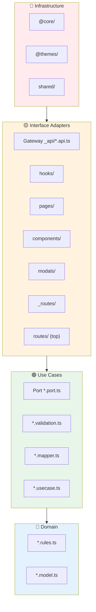
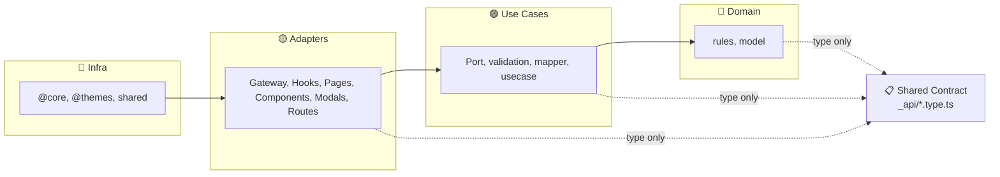
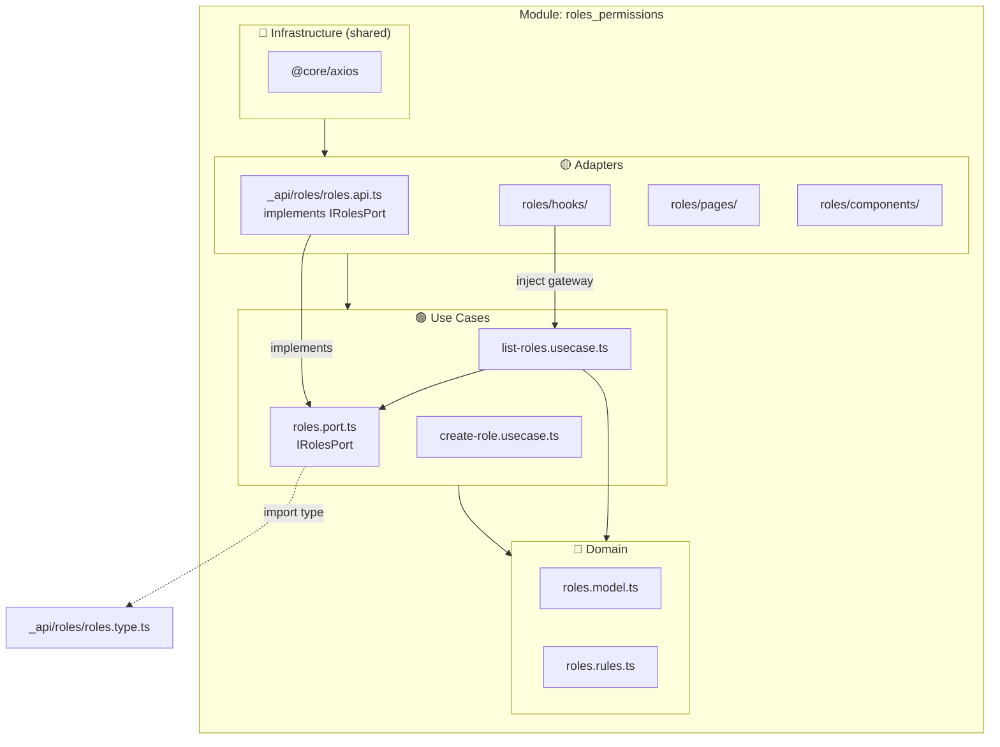

# Onion Diagram — Clean Architecture (Frontend)

Sơ đồ đồng tâm theo kiến trúc hiện tại: dependencies chỉ hướng **vào trong**.  
📋 **Shared Contract** (`_api/*.type.ts`) là type-only, mọi layer đều có thể import.

---

## 1. Onion rings (layers)

```
                    ┌─────────────────────────────────────────────────────────┐
                    │  🔴 INFRASTRUCTURE (outer)                               │
                    │  @core/  @themes/  shared/                               │
                    │  Axios, React, MUI, Zustand, OpenAPI, MSW                │
                    └───────────────────────────┬───────────────────────────────┘
                                                │ depends on
                    ┌───────────────────────────▼───────────────────────────────┐
                    │  🟡 INTERFACE ADAPTERS                                    │
                    │  Gateway (_api/*.api)  Hooks  Pages  Components  Modals   │
                    │  _routes/  routes/ (top-level)                           │
                    └───────────────────────────┬───────────────────────────────┘
                                                │ depends on
                    ┌───────────────────────────▼───────────────────────────────┐
                    │  🟢 USE CASES                                             │
                    │  _usecases/  —  Port (*.port.ts), validation, mapper      │
                    │  Pure: validate → map → call Port → map response          │
                    └───────────────────────────┬───────────────────────────────┘
                                                │ depends on
                    ┌───────────────────────────▼───────────────────────────────┐
                    │  🔵 DOMAIN (innermost)                                    │
                    │  _domain/  —  rules, models, domain functions             │
                    └─────────────────────────────────────────────────────────┘

                    ┌ - - - - - - - - - - - - - - - - - - - - - - - - - - - - ┐
                    │  📋 SHARED CONTRACT  _api/*.type.ts  (type-only)         │
                    │  Any layer may import — compile-time only, no runtime   │
                    └ - - - - - - - - - - - - - - - - - - - - - - - - - - - - ┘
```

---

## 2. Mermaid — Onion (flowchart)



---

## 3. Mermaid — Dependency rule (simplified)



---

## 4. Per-module onion (e.g. roles_permissions)



---

## 5. Golden rule (summary)

| Layer                         | May import from                                                                  |
| ----------------------------- | -------------------------------------------------------------------------------- |
| 🔵 Domain                     | Domain (same module), Shared Contract (same module), shared                      |
| 🟢 Use Cases                  | Domain, Use Cases (same module), Shared Contract (same module), shared           |
| 🟡 Gateway                    | **Use Cases (Port)**, Shared Contract, core, shared                              |
| 🟡 Adapters (hooks, pages, …) | Domain, Use Cases, Gateway, Shared Contract, module-routes, core, themes, shared |
| 🔴 Infrastructure             | core, themes, shared                                                             |
| 📋 Shared Contract            | core (for type source)                                                           |

**Port pattern:** Use Case chỉ phụ thuộc **Port** (interface trong \_usecases). Gateway (outer) **implement** Port → dependency hướng vào trong. Adapter (hook) **inject** gateway khi gọi: `useCase(rolesApi, ...)`.
